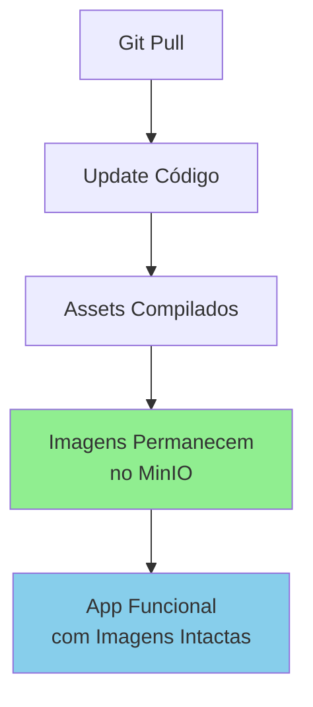

# Configuração de Persistência de Imagens com MinIO

## Visão Geral
Este guia garante que suas imagens permaneçam no MinIO quando você atualizar o projeto (git pull, deployment, etc.).

## Arquitetura de Armazenamento

```
┌─────────────────────────────────────────┐
│         Aplicação Laravel               │
└─────────────────────────────────────────┘
                    ↓
        ┌───────────────────────┐
        │  Storage Driver S3    │
        │   (via MinIO API)     │
        └───────────────────────┘
                    ↓
        ┌───────────────────────┐
        │   MinIO Object Store  │
        │   (Dados Persistos)   │
        └───────────────────────┘
```

## Configuração

### 1. Variáveis de Ambiente (.env)

Para usar MinIO como armazenamento principal:

```bash
# Defina o disco padrão como MinIO
FILESYSTEM_DISK=minio

# Configuração do MinIO
MINIO_ENDPOINT=http://minio:9000
MINIO_ACCESS_KEY_ID=minioadmin
MINIO_SECRET_ACCESS_KEY=minioadmin
MINIO_BUCKET=apostolado
MINIO_REGION=us-east-1
MINIO_URL=http://localhost:9000/apostolado  # URL pública para acesso aos arquivos
MINIO_USE_PATH_STYLE_ENDPOINT=true
```

### 2. Atualizar docker-stack.yml

Descomente as variáveis do MinIO:

```yaml
FILESYSTEM_DISK: minio
MINIO_ENDPOINT: http://minio:9000
MINIO_ACCESS_KEY_ID: minioadmin
MINIO_SECRET_ACCESS_KEY: minioadmin
MINIO_BUCKET: apostolado
MINIO_REGION: us-east-1
MINIO_USE_PATH_STYLE_ENDPOINT: "true"
MINIO_URL: http://localhost:9000/apostolado
```

### 3. Volumes do MinIO no Docker Compose

Se você está usando `docker-compose.yml` local com MinIO:

```yaml
minio:
  image: minio/minio
  container_name: apostolado_minio
  restart: unless-stopped
  command: server /data --console-address ":9001"
  environment:
    MINIO_ROOT_USER: minioadmin
    MINIO_ROOT_PASSWORD: minioadmin
  volumes:
    - minio_data:/data
  ports:
    - "9000:9000"
    - "9001:9001"
  networks:
    - apostolado_network
  healthcheck:
    test: ["CMD", "curl", "-f", "http://localhost:9000/minio/health/live"]
    interval: 10s
    timeout: 5s
    retries: 5

volumes:
  minio_data:
    driver: local
```

## Por que as Imagens Persistem

✅ **MinIO é um serviço separado** - Não é deletado quando você faz `git pull` ou redeploy
✅ **Volume persistente** - As imagens são armazenadas em `/data` (volume do Docker)
✅ **API S3-compatible** - A aplicação Laravel comunica com MinIO sem conhecer detalhes internos
✅ **Independente do código** - Alterações no código não afetam dados armazenados

## Migração de Dados (Local → MinIO)

Se você já tem imagens armazenadas localmente e quer migrá-las para MinIO:

### Método 1: Via Console (Manual)
1. Acesse MinIO Console: `http://localhost:9001`
2. Login com `minioadmin:minioadmin`
3. Crie um bucket chamado `apostolado`
4. Upload manual dos arquivos de `storage/app/public`

### Método 2: Via Artisan Command (Automático)

Crie um comando:

```bash
php artisan storage:migrate-to-minio
```

Conteúdo do comando em `app/Console/Commands/MigrateToMinio.php`:

```php
<?php

namespace App\Console\Commands;

use Illuminate\Console\Command;
use Illuminate\Support\Facades\Storage;
use RecursiveDirectoryIterator;
use RecursiveIteratorIterator;

class MigrateToMinio extends Command
{
    protected $signature = 'storage:migrate-to-minio';
    protected $description = 'Migrate files from local storage to MinIO';

    public function handle()
    {
        $sourcePath = storage_path('app/public');
        
        if (!is_dir($sourcePath)) {
            $this->error('Diretório local não encontrado!');
            return 1;
        }

        $this->info('Iniciando migração de arquivos para MinIO...');

        $files = new RecursiveIteratorIterator(
            new RecursiveDirectoryIterator($sourcePath),
            RecursiveIteratorIterator::SELF_FIRST
        );

        $migrated = 0;
        $skipped = 0;

        foreach ($files as $file) {
            if ($file->isDir()) continue;
            
            $relativePath = substr($file->getRealPath(), strlen($sourcePath) + 1);
            $relativePath = str_replace(DIRECTORY_SEPARATOR, '/', $relativePath);

            try {
                $contents = file_get_contents($file->getRealPath());
                Storage::disk('minio')->put($relativePath, $contents);
                $this->line("✓ {$relativePath}");
                $migrated++;
            } catch (\Exception $e) {
                $this->warn("✗ {$relativePath}: {$e->getMessage()}");
                $skipped++;
            }
        }

        $this->info("Migração concluída!");
        $this->info("Arquivos migrados: {$migrated}");
        $this->info("Arquivo pulados: {$skipped}");

        return 0;
    }
}
```

## Verificação Pós-Configuração

### 1. Testar Conexão
```bash
php artisan tinker
Storage::disk('minio')->put('test.txt', 'Hello MinIO');
Storage::disk('minio')->get('test.txt');
```

### 2. Verificar Console MinIO
Acesse `http://localhost:9001` e confirme que o arquivo `test.txt` aparece no bucket.

### 3. Testar Upload de Imagem
1. Vá para admin panel e upload uma imagem
2. Verifique se aparece no MinIO Console
3. Acesse via URL: `http://localhost:9000/apostolado/path/to/file`

## Fluxo de Atualização (Git Pull)



## Troubleshooting

### Problema: Imagens não carregam
**Causa:** URL do MinIO incorreta na env
**Solução:** 
```bash
# Local development
MINIO_URL=http://localhost:9000/apostolado

# Docker Compose
MINIO_URL=http://minio:9000/apostolado

# Produção
MINIO_URL=https://seu-minio.com/apostolado
```

### Problema: Acesso negado ao MinIO
**Causa:** Credenciais incorretas
**Solução:** Verificar `MINIO_ACCESS_KEY_ID` e `MINIO_SECRET_ACCESS_KEY`

### Problema: Uploads funcionam mas imagens não carregam
**Causa:** MINIO_URL incorreta na configuração
**Solução:** Testar em `http://minio-console:9001` se arquivo está lá

## Checklist Pós-Implementação

- [ ] Variáveis do MinIO configuradas no `.env`
- [ ] `FILESYSTEM_DISK=minio` está ativo
- [ ] MinIO serviço está rodando e saudável
- [ ] Bucket `apostolado` foi criado
- [ ] Upload de test funciona
- [ ] Imagens aparecem via URL do MinIO
- [ ] Backup do bucket configurado (se necessário)

## Referências

- [MinIO Documentation](https://docs.min.io)
- [Laravel Storage Configuration](https://laravel.com/docs/11.x/filesystem)
- [AWS S3 API Compatibility](https://docs.min.io/minio/baremetal/core-concepts/aws-s3-compatibility.html)
